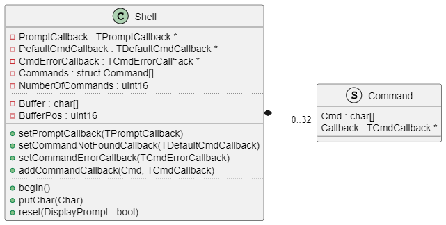

# Shell

Library for supplying a shell command interface. 


## General

The command parser supports the backslash and quotes, the command interface match the `main(int argc, char *argv[])` mechanism.

The library does not have any dependencies to other libraries.
It does not use `new` or `malloc`, so it can be used in an environment where 
dynamic memory allocation is not available (e.g. safety critical environment).


## Features

* Commands can be passed to the library letter by letter or as a complete string
* Separation of the string into command and arguments
* Quotation mark support
* Backslash support to escape spaces or quotes
* Callback format for commands corresponds to main() with its argc/argv mechanism
* Return codes 
* Implemented as C++ class with common Arduino style guide
* Low memory consumption overhead


## Integration

Here the integration of the Shell library is shown:

* Include the library

  ```C++
  #include <shell.h>
  ```

* Create an instance of the Shell class:

  ```C++
  Shell myShell;
  ```

## Implementation of Callbacks

* Implement the callbacks needed for the shell. You need one callback which simply outputs the prompt (`shell_display_prompt`). You also need a callback which can be called if an unknown command was entered (`shell_cmd_not_found`). Additionally you could need a callback which is called when a command returned an error (`shell_cmd_error`).

  ```C++
  // This callback is needed to output the command 
  // prompt ("> " in this case) to the serial device. 
  void shell_display_prompt(void)
  {
    Serial.print("> ");
    return;
  }

  // This callback is called when an unknown command is received. 
  void shell_cmd_not_found(char *pc_Cmd)
  {
    Serial.print("Command '");
    Serial.print(pc_Cmd);
    Serial.println("' not found (try command 'echo')");
    return;
  }

  // This callback is called when a command returned an error code. 
  void shell_cmd_error(char *pc_Cmd, int rc)
  {
    Serial.print(pc_Cmd);
    Serial.print(" failed returncode ");
    Serial.print(rc);
    Serial.println();
  }
  ```

  And of course you need all the callbacks for the various commands (for example `shell_cmd_echo`):

  ```C++
  // This is the callback for the command "echo". 
  // It is called everytime the command is received.
  // The parameter "argc" holds the number of arguments, 
  // the parameter argv hold an array of arguments  
  // (including the command itself as the first parameter) 
  int shell_cmd_echo(int argc, char *argv[])
  {
    if(argc<2) {
      Serial.println("usage: echo <text>");
      return 5; // an error occured - return anything different to 0
    }
    for(int i=1; i<argc; i++) {
      Serial.print(argv[i]);
      Serial.print(" ");
    }
    Serial.println();
    return 0; // command executed sucessfully
  }
  ```

## Usage

* setup:

  The two implemented mandatory callbacks (`shell_cmd_not_found()` and `shell_display_prompt()`) must be registered to the Shell object.

  ```C++
  myShell.setCommandNotFoundCallback(&shell_cmd_not_found);
  myShell.setCommandErrorCallback(&shell_cmd_error);
  myShell.setPromptCallback(&shell_display_prompt);
  ```

  Every command callback (for example `echo()`) must also be registered.

  ```C++
  myShell.addCommandCallback("echo", &shell_cmd_echo);
  ```

  The `begin()` method is neded for initially calling the prmopt callback. 

  ```C++
  myShell.begin();
  ```

* operation: 

  Within the loop() function, the following code passes the incoming data on the serial line to the Shell library.  

  ```C++
  if(Serial.available()) {
    char c = Serial.read();
    myShell.putChar(c);
  }
  ```

  It might make sense to echo the entered characters back to the serial line, otherwise the user does not see the entered command in the terminal program. In this case, the following code can be used:

  ```C++
  if(Serial.available()) {
    char c = Serial.read();
    if(c == '\r') {
      Serial.println(); 
    } 
    else {
      Serial.write(c);
    }
    myShell.putChar(c);
  }
  ```

## Diagrams

### Class Diagram

This diagram illustrates the shell class. There are no other classes or important structures within this library.



### Sequence Diagram

This sequence diagram illustrates the initialization and the usage of the shell class. 


## Limitations
                                               
* The number of commands is limited to 32 
* The length of a command (including arguments) is limited to 80
* The number of arguments per command is limited to 8

These are the default limitations. Other limits can be configured within the include file shell.h.


## Known Anomalies

* none


## Changelog

### 1.1.0

* Support for empty arguments ("") added
* Support of error callback added

### 1.0.1

* Documentation improved

### 1.0.0

* Initial release


## Website

Further information can be found on [GitHub](https://github.com/steftri/shell).
